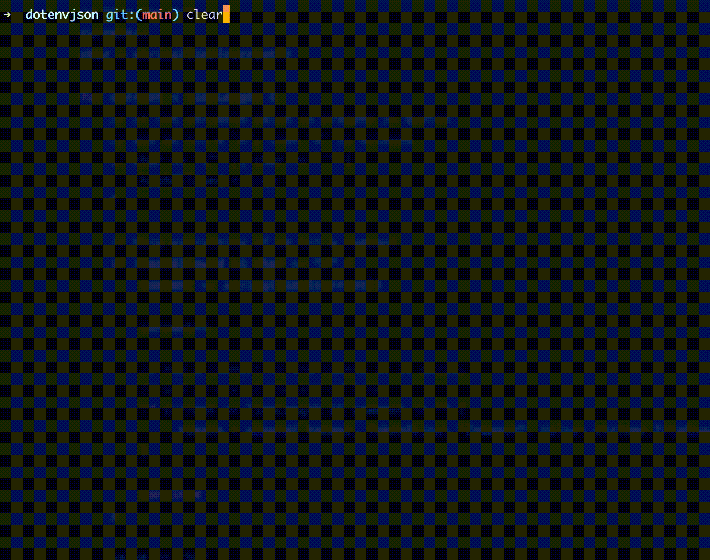

# dotenvjson

Convert .env files to JSON. 📄



## About

I have used principles from creating a programming language to transform a .env file to JSON. It is kind of an tweaked approach, but works fine. 🔥

`This is overengineered`
Yes, I know. This is the fun factor. I am aware this can be solved in an easier way, but as many other things on github, I created this tool for fun in a way that is challenging.

Don't you go look at my messy tokenizer.go file 😏

## Usage

```bash
dotenvjson -h
Usage of dotenvjson:
  -o  string  Save the output to file. -o=file.json
  -p  bool    Pretty print the output. (default false)
  -pt bool    Print to terminal. (default true)
```

## Build

```bash
go build -o bin/dotenvjson
```

## Releases

Have a look at the releases page for binaries.

## Example

```bash
###############################
#    .env.example content     #
###############################
cat .env.example

# Environment variables.
STATUS=production
#Development port
DEV_PORT=1337
# Production port
PROD_PORT=8080

# DB CONFIG
HOST=db.host
USER=root
PASSWORD=betterlucknexttime!
DB =hackers_exposed
DIALECT = mysql # wow working comment

WOW = "such nice # work"

INTERPOLATED="Multiple\nLines and variable substitution: ${SIMPLE}"
NON_INTERPOLATED='raw text without variable interpolation'

JSON='{"key":"value","nested":{"key":"value"},"number":1}'

###############################
#  Now run the transformation #
###############################
dotenvjson -p -o=demo.json .env.example

# or pipe the data such as this:
# cat .env.example | dotenvjson -p -o=demo.json
{
  "DB": "hackers_exposed",
  "DEV_PORT": "1337",
  "DIALECT": "mysql",
  "HOST": "db.host",
  "INTERPOLATED": "\"Multiple\\nLines and variable substitution: ${SIMPLE}\"",
  "JSON": "'{\"key\":\"value\",\"nested\":{\"key\":\"value\"},\"number\":1}'",
  "NON_INTERPOLATED": "'raw text without variable interpolation'",
  "PASSWORD": "betterlucknexttime!",
  "PROD_PORT": "8080",
  "STATUS": "production",
  "USER": "root",
  "WOW": "\"such nice # work\""
}

###############################
#      demo.json content      #
###############################
cat demo.json
{
  "DB": "hackers_exposed",
  "DEV_PORT": "1337",
  "DIALECT": "mysql",
  "HOST": "db.host",
  "INTERPOLATED": "\"Multiple\\nLines and variable substitution: ${SIMPLE}\"",
  "JSON": "'{\"key\":\"value\",\"nested\":{\"key\":\"value\"},\"number\":1}'",
  "NON_INTERPOLATED": "'raw text without variable interpolation'",
  "PASSWORD": "betterlucknexttime!",
  "PROD_PORT": "8080",
  "STATUS": "production",
  "USER": "root",
  "WOW": "\"such nice # work\""
}
```

## Missing, but coming

- multiline parsing support

## License

See [LICENSE](LICENSE)
